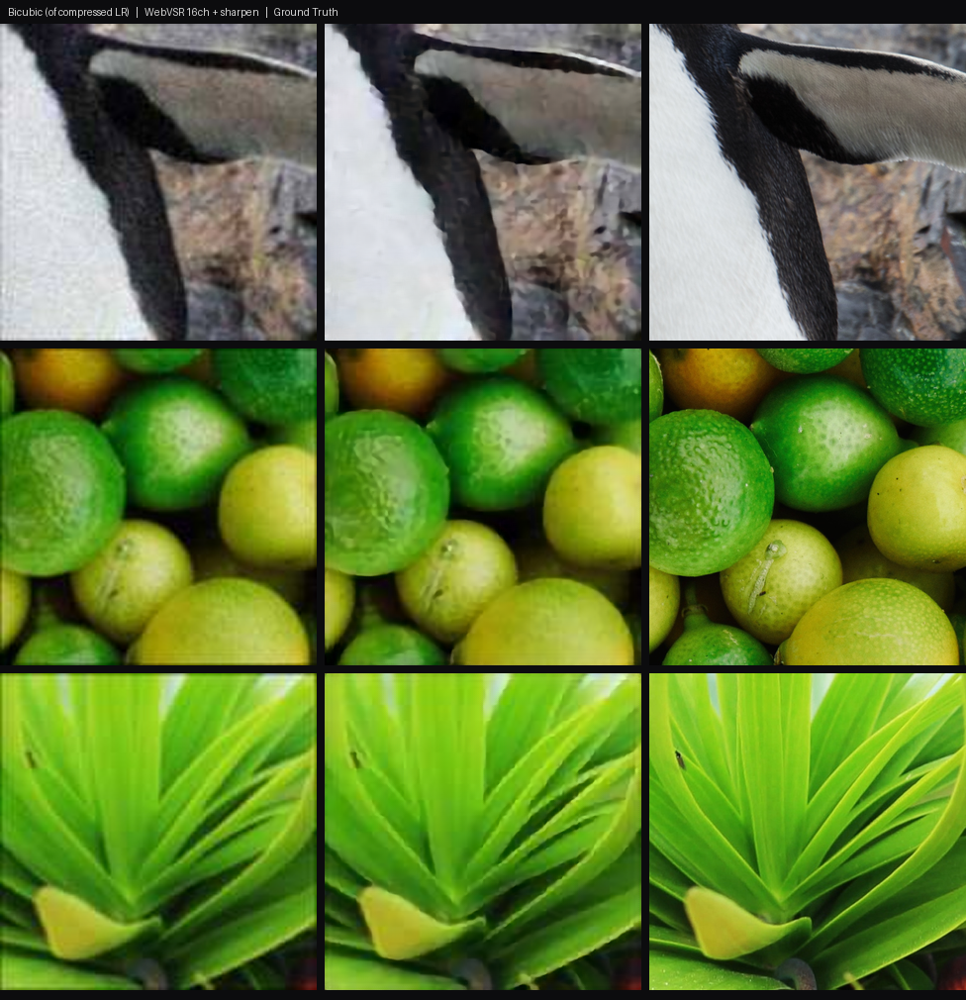

# WebVSR

Real-time video super-resolution in the browser, on your own GPU. A Chrome
(MV3) extension that upscales low-resolution / compressed web video live via a
hand-written **WebGPU** pipeline - no servers, no uploads, no ONNX Runtime.

It shines where plain math upscaling can't: **removing compression artifacts**
(JPEG/codec blocking, ringing, noise) from low-res sources, then finishing with
a contrast-adaptive sharpen. On already-sharp/high-res video it stays out of the
way.

## Highlights

- **Real-time on modest hardware.** A 16-channel SPAN-Lite (2×) runs
  720p→1440p in ~22 ms (≈46 fps) on an RTX 2070 SUPER. Hand-written WGSL compute
  shaders (2×2 register-blocked convolutions), zero-copy from the video via
  `importExternalTexture`.
- **Never makes playback worse.** A frame-time governor (like a game engine's
  dynamic-resolution scaling) keeps the model inside the video's frame budget; if
  it still can't match the source framerate, it passes the original through
  untouched.
- **Contrast-adaptive sharpening** (FSR-RCAS style, clamped to local min/max so
  it adds crispness without halos).
- **On-device & private.** Everything runs locally in the page.
- Runs on any site / any `<video>` (all frames).

## Results

On realistically **compressed** low-res input (what real web video looks like),
WebVSR removes blocking/noise that bicubic just enlarges - reconstruction, not
fabrication:



*Left: bicubic. Middle: WebVSR. Right: ground truth.* On already-sharp/clean
sources the gain is small (a good bicubic is hard to beat there) - which is
exactly why **Auto-engage** only spends GPU when the source is genuinely
low-res.

## How it works

`content.js` detects videos and drives `webgpu-sr.js`, which implements the SR
network as WGSL compute shaders:

```
video → importExternalTexture → conv_first → 4× SPAB blocks → concat → conv_last
      → PixelShuffle(2×) → Catmull-Rom finish (to display size) → adaptive sharpen → canvas
```

The model (SPAN-Lite, reparameterized to plain 3×3 convs at inference) is trained
in PyTorch (`training/train_span.py`) on a Real-ESRGAN-style degradation pipeline
(`training/dataset.py`) so it learns to undo real compression, then exported to a
flat binary + JSON manifest (`training/export_webgpu_weights.py`) that the engine
loads into GPU buffers.

## Install (unpacked)

1. `chrome://extensions` → enable Developer mode → **Load unpacked** →
   select the `extension/` folder.
2. Open a video, click the **SR** button on it (or press **Alt+S**).
3. Settings live in the toolbar popup and the on-video ⚙ flyout: GPU load,
   quality, target resolution, sharpness, per-site disable, and more.

## Repo layout

- `extension/` - the Chrome extension (engine, content script, popup, models).
  This is what you load unpacked / package for the Web Store.
- `training/` - the ML side: SPAN-Lite architecture (`model_span.py`), training
  (`train_span.py`, `dataset.py`, `losses.py`), weight export
  (`export_webgpu_weights.py`), evaluation and visual comparisons
  (`evaluate.py`, `make_compare_*.py`), and `OPTIMIZATION_LOG.md` - the full
  record of how the real-time kernel was built.
- `dev/` - browser benchmarking harnesses (`perf.html`, `bench.html`,
  `test-live.html`) for profiling the engine outside the extension.
- `results/` - the comparison images shown in this README.

## Status

Engine and models are verified on real hardware. The extension's UI wiring is
functional; issues/PRs welcome.
