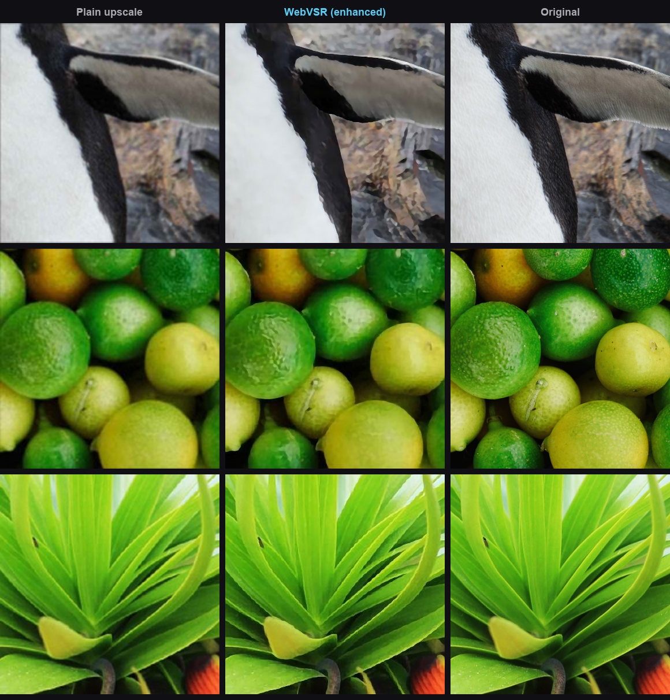

# WebVSR: Video Upscaler & Enhancer

Make blurry, low-quality video look sharper and clearer, right in your browser,
using your own computer's GPU. WebVSR is a Chrome (MV3) extension that upscales
and cleans up low-resolution / compressed web video live, through a hand-written
**WebGPU** pipeline. No servers, no uploads, no sign-up.

## What it does

A lot of web video is low-resolution and heavily compressed, so it looks soft,
blocky, or fuzzy. WebVSR reconstructs a cleaner, sharper picture in real time and
finishes with a contrast-adaptive sharpen. It shines exactly where plain math
upscaling (bicubic/Lanczos) can't: **removing compression artifacts** (JPEG/codec
blocking, ringing, noise) rather than just enlarging them.

It's honest about what it does. It makes a genuinely better picture from
low-quality video, but it does not invent fake detail, and it leaves already-sharp
video alone so it isn't working your GPU for nothing.

## Highlights

- **Real-time on modest hardware.** A 16-channel SPAN-Lite (2×) runs
  720p → 1440p in about 22 ms (~46 fps) on an RTX 2070 SUPER. Hand-written WGSL
  compute shaders (2×2 register-blocked convolutions), zero-copy from the video
  via `importExternalTexture`.
- **Never makes playback worse.** A frame-time governor (like a game engine's
  dynamic-resolution scaling) keeps the model inside the video's frame budget. If
  it still can't match the source frame rate, it passes the original through
  untouched.
- **Only runs when it helps.** Auto-engage skips SR when the source is already
  about as sharp as your screen, so no GPU is spent for no gain.
- **Contrast-adaptive sharpening** (FSR-RCAS style, clamped to the local
  neighborhood so it adds crispness without halos), with an optional custom slider.
- **On-device and private.** Everything runs locally on the page. Nothing is
  uploaded and no data is collected.
- Works on any site, on any HTML5 `<video>`.

## The honest quality story

On realistically **compressed** low-res input (what real web video actually looks
like), WebVSR removes the blocking and noise that bicubic just enlarges. This is
reconstruction, not fabrication:



*Left: a plain upscale of the compressed source. Middle: WebVSR at max quality
with sharpening turned up. Right: the original.* On already-sharp, clean sources
the gain is small (a good plain upscale is hard to beat there), which is exactly
why Auto-engage only spends GPU when the source is genuinely low-res.

## How it works

`content.js` detects videos and drives `webgpu-sr.js`, which implements the SR
network as WGSL compute shaders:

```
video -> importExternalTexture -> conv_first -> 4x SPAB blocks -> concat -> conv_last
      -> PixelShuffle(2x) -> Catmull-Rom finish (to display size) -> adaptive sharpen -> canvas
```

The model (SPAN-Lite, reparameterized to plain 3×3 convs at inference) is trained
in PyTorch (`training/train_span.py`) on a Real-ESRGAN-style degradation pipeline
(`training/dataset.py`) so it learns to undo real compression, then exported to a
flat binary + JSON manifest (`training/export_webgpu_weights.py`) that the engine
loads into GPU buffers.

## Install

**Load unpacked (developer mode):**

1. Go to `chrome://extensions` and turn on **Developer mode**.
2. Click **Load unpacked** and select the `extension/` folder.
3. Open a video and click the **SR** button on it, or press **Alt+S**.
4. Settings live in the toolbar popup and the on-video gear flyout: GPU load,
   quality, target resolution, sharpness, per-site disable, and more.

You'll need a recent version of Chrome with WebGPU support and a GPU. If WebGPU
isn't available, the extension simply stays off.

## Roadmap

Where this is headed:

- **Lighter, better upscaling models.** More quality for less GPU, so it runs
  smoothly on weaker hardware and leaves more headroom on strong hardware.
- **Frame interpolation (the big one).** A motion-smoothing model that generates
  in-between frames to raise the effective frame rate and smooth out choppy or
  low-fps video. Groundwork exists in `training/model_rife_lite.py`; bringing it to
  the real-time WebGPU pipeline is the main future project.

## Privacy

Everything runs locally on your device. No video ever leaves your computer,
nothing is uploaded, and no data is collected. Full policy:
[PRIVACY.md](PRIVACY.md).

## Repo layout

- `extension/`: the Chrome extension (engine, content script, popup, models).
  This is what you load unpacked or package for the Web Store.
- `training/`: the ML side. SPAN-Lite architecture (`model_span.py`), training
  (`train_span.py`, `dataset.py`, `losses.py`), weight export
  (`export_webgpu_weights.py`), evaluation and visual comparisons
  (`evaluate.py`, `make_compare_*.py`), the frame-interpolation groundwork
  (`model_rife_lite.py`, `train_rife.py`), and `OPTIMIZATION_LOG.md` (the full
  record of how the real-time kernel was built).
- `dev/`: browser benchmarking harnesses (`perf.html`, `bench.html`,
  `test-live.html`) for profiling the engine outside the extension.
- `results/`: the images shown in this README.

## Status

The engine and models are verified on real hardware, and the extension is being
prepared for the Chrome Web Store. Issues and pull requests are welcome.
